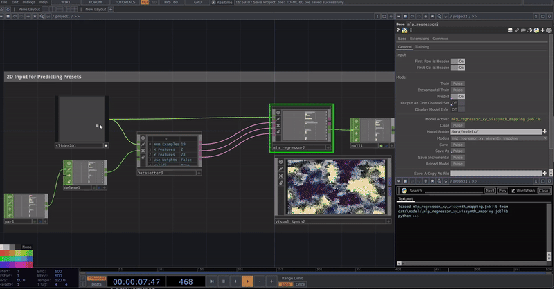
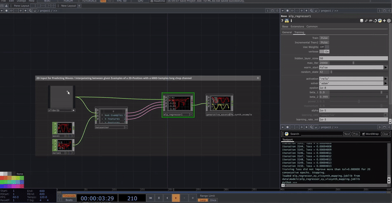

# TD-ML - TouchDesigner Machine Learning Toolkit 

A set of [TouchDesigner](https://derivative.ca/) components integrating machine-learning algorithms into TD's node-based CHOP workflows. Based on [scikit-learn](https://scikit-learn.org), [PyTorch](https://pytorch.org/), [skorch](https://skorch.readthedocs.io/en/stable/), [umap-learn](https://umap-learn.readthedocs.io/en/latest/). Inspired by [Wekinator](https://doc.gold.ac.uk/~mas01rf/Wekinator/) & [FluCoMa](https://www.flucoma.org/) for MaxMSP.

Join the [Discord](https://discord.gg/KzpH76P68X) for questions, sharing datasets and trained models, bug reports, and feedback. Tutorials will be available soon on [YouTube](https://www.youtube.com/@bi.os_td). The [Project File](TD-ML.toe) includes several examples.

---
 

*MLP Regressor: Slider2D Mapping to 28D Visual Synth Pars*

*MLP Classifier: Audio (Voice) Classification & UMAP Visualization*
 

## Description 

This project originated as a university learning initiative and continues to serve that purpose. However, its objective is to evolve into a broadly usable and adaptable toolkit.

Please note that certain components may not yet be fully refined or entirely stable. Functionality may change as development progresses. The project should therefore be considered Beta / Experimental.

The toolkit lets you train small neural networks and run ML pipelines from scratch on any CHOP data using a few components, without writing Python. It includes **Classification & Regression** (MLP and LSTM), **Variational Autoencoders (VAE)** for unsupervised latent learning and reconstruction, **dimension reduction** (UMAP and others in progress), and the **Datasetter** for creating and managing datasets from CHOP/DATs. Suitable for classification, regression, latent exploration, and visualization on any CHOP data (tracking, sensors, audio, control parameters, etc.).

Furthermore, I'd be happy if anyone is interested in contributing in any capacity - feel free to write me a DM or to open an issue or submit a pull request on GitHub. 

## Installation

You need to load a virtual python environment into TD based on provided [requirements.txt](./requirements.txt) or [environment.yml](./environment.yml).

### TouchDesigner 2025

The [TDPyEnvManager](https://derivative.ca/community-post/introducing-touchdesigner-python-environment-manager-tdpyenvmanager/72024) from Palette loads a Python Environment into TD.

#### Option I: venv 

1. Drag and Drop [TDPyEnvManager](https://derivative.ca/community-post/introducing-touchdesigner-python-environment-manager-tdpyenvmanager/72024) from Palette to your Project
2. Choose "venv" mode
3. Set the path to be the folder where you want to install the virtual environment to
4. Set the name it should have (eg. "td-ml")
5. Pulse "create venv from requirements.txt" (make sure you copied requirements.txt from the repo to your project folder)
6. Wait and Restart TD if finished succesfully

*In another project if you want to load that venv, you just have to set the path in the TDPyEnvManager correctly to where you installed it to the first time and set name accordingly*

#### Option II: conda 

1. `conda create -n td-ml python=3.11.10 -y`
2. `conda activate td-ml`
3. `cd C:\Users\Username\Documents\GitHub\TD-ML` 
*(cd to downloaded TD-ML folder on your system, as requirements.txt lives there)*
4. `pip install -r requirements.txt`
5. Drag and Drop [TDPyEnvManager](https://derivative.ca/community-post/introducing-touchdesigner-python-environment-manager-tdpyenvmanager/72024) from Palette to your Project
6. Choose "conda" mode
7. Set the path to be the folder where you want to installed conda to 
8. Select and Load 'td-ml'

*In another project if you want to load that conda venv, you just have to set the path in the TDPyEnvManager correctly to where you installed conda to and set name accordingly*

### CUDA Support for LSTMs & VAE
Note that, LSTMs and VAE components have the option to chose "Device", which can be set to CUDA. This requires an additional step for installation as the requirements.txt as is, only includes Torch's CPU Wheel to avoid unnecessary download sizes for Users not making use of this. 

**If you know in advance (before first installation) that you want to be able to use that**:
1. Go edit requirements.txt 
2. Replace the first line (``--extra-index-url https://download.pytorch.org/whl/cpu``) with:

 ``--extra-index-url https://download.pytorch.org/whl/cu128``

3. Then follow your prefered Env Installation Method, as described above. 

 

**If you already have the env installed and want to add the CUDA support**:
1. Activate the environment in preferred CMD Window - e.g. going to the PyEnvManager in your TOE Project and pulse "Open CLI" 
2. This open a CMD Window where your ENV should be alreday activated so you can just:

``pip install torch==2.10.0 --extra-index-url https://download.pytorch.org/whl/cu128 --force-reinstall --no-cache-dir``

*Note that the CUDA Wheel is ~3GB.*

## Components

### Neural Network

- **MLP-Classifier**: A multi-layer perceptron neural network for classification tasks. A feedforward network that learns to map input features to discrete class labels, suitable for pattern recognition and categorical prediction tasks.

- **MLP-Regressor**: A multi-layer perceptron neural network for regression tasks. A feedforward network that learns to map input features to continuous numerical values, suitable for predicting continuous outputs and value estimation.

- **LSTM-Classifier**: A Long-Short-Term-Memory neural network for classification tasks. Designed to handle sequential data with temporal dependencies, making it ideal for time-series classification, gesture recognition, and other sequence-based categorical predictions. Supports CPU/CUDA device selection. *(Work in progress)*

- **LSTM-Regressor**: A Long-Short-Term-Memory neural network for regression tasks. Designed to handle sequential data with temporal dependencies, making it ideal for time-series forecasting, continuous sequence prediction, and other regression tasks involving temporal patterns.Supports CPU/CUDA device selection. 

- **VAE** (Variational Autoencoder): An unsupervised neural network that learns a latent representation of your data from a single feature table (rows = samples, cols = features). Train once, then use **Encode** to map inputs to the latent space and **Decode** to reconstruct or interpolate (e.g. latent-in-between for smooth transitions). Supports CPU/CUDA device selection and configurable latent dimension, encoder/decoder hidden sizes, and beta (KL weight).

### Manifold

- **UMAP** (Uniform Manifold Approximation and Projection): 
A dimensionality reduction tool that seeks to preserve both global and local structure of high-dimensional data when embedding it into a lower-dimensional space.

- **Isomap**: Isometric Mapping - a nonlinear dimensionality reduction method that preserves geodesic distances between data points. *(Work in progress - example implementations)*

- **SpectralEmbedding**: Spectral Embedding - a nonlinear dimensionality reduction method based on the spectral decomposition of the graph Laplacian. *(Work in progress - example implementations)*

### Decomposition 

- **PCA**: Principal Component Analysis - a linear dimensionality reduction technique that projects data onto lower-dimensional subspaces while preserving maximum variance. *(Work in progress - example implementations)*

- **KernelPCA**: Kernel Principal Component Analysis - a nonlinear extension of PCA that uses kernel functions to map data to higher dimensions before applying PCA. *(Work in progress - example implementations)*

- **SparsePCA**: Sparse Principal Component Analysis - a variant of PCA that produces sparse components, useful for interpretability and feature selection. *(Work in progress - example implementations)*

### Clustering

- **K-Means**: A clustering component for unsupervised learning,
which groups similar data points into clusters. *(Work in progress)*

### Helpers

- **Datasetter**: Comprehensive dataset management tool for creating, editing, and managing datasets from CHOP channels and DATs. Features include recording and snapping data, save/load functionality, data sanitization, missing value removal, and weight assignment based on data quality conditions. For training sequential neural networks there is an option to add seq_id.

- **Filter Samples**: Filters/Smooths across the samples of a CHOP channel using various filters from scipy.signal

- **Dynamic Inputs**: Example tox illustrating dynamic type of COMPs input switching, limited to 3 at the moment. *(example implementations)*

- **Visual Synth**: Noisy Pattern Visuals Generator, used as Example for illustrating use-cases.

- **Wavetable Synth**: Wave Table Audio Synth, used as Example for illustrating use-cases.

### Audio (not included)

- **[td_mfcc](https://github.com/hrtlacek/td_mfcc )** by hrtlacek / Patrik Lechner

## More Usage Examples

*MLP Regressor: Leap Motion (1 Hand - 46 Channels) 46D Mapping to 28D Visual Synth Pars*

*MLP Regressor: Slider2D Mapping to 120D Wavetable Synth chop-samples)*
 

*MLP Classifier: Facial Expression Classification (using face_tracking from [mediapipe](https://github.com/torinmb/mediapipe-touchdesigner) by Torin Blankensmith)*
 

## Future Development

### Datasetter
- **File I/O rework:** Redesign from the ground up to support multiple file types (CSV, JSON, NPY). Store each dataset in a single file (instead of splitting X, Y, W) and include useful metadata in that file.
- **Recording-time labels:** Currently the dat input is applied after recording (one label per recording). Support changing the dat during recording and persisting those changes in the recording.
- **Undo:** Add an undo button with proper history support.
- **Item editing:** Provide a solution or interface for editing individual dataset items.

### General
- **Overwrite warnings:** When saving would overwrite an existing dataset or model, show a clear warning to the user before proceeding.
- **ThreadedTraining:** Support cancelling threaded training runs; improve training speed when using Threaded Training. Fix project Start Warning / Bug on current Threadmanager Usage. 
- **Decomposition & manifold:** Fully integrate and test existing decomposition and manifold components (currently only UMAP is fully functional and tested).
- **Clustering & unsupervised:** Implement more clustering and unsupervised methods and workflows.

### UMAP
- **File I/O integration:** Integrate with the other file I/O layers for loading and saving.

### VAE
- **Offline / out-of-TD training:** VAEs typically benefit from larger datasets and longer training. An offline or external training path (outside real-time TD) would make this more practical.
- **Usage and example ideas:**
  - **Latent mappings:** As in the [NIME paper](https://nime.pubpub.org/pub/latent-mappings/release/1) by [Tim Murray-Browne](https://nime.pubpub.org/user/tim-murray-browne) and [Panagiotis Tigas](https://nime.pubpub.org/user/panagiotis-tigas): train a VAE on input streams (e.g. Kinect) and use the latent representation directly to drive synthesis or parameters—avoiding fixed one-to-one mappings. Unlike supervised regressors, you don’t have to define input→output in advance, so the workflow is more explorative. Trade-off: more data is usually needed (e.g. 16 hours in the paper). 
  - **Classical VAE use:** Between encoder and decoder, latent variables can be edited via CHOPs (e.g. Math CHOP) to alter or synthesize motion/CHOP data (similar to [RAVE](https://github.com/acids-ircam/RAVE) for audio synthesis). Combining this with an MLP regressor lets you map a defined control space (e.g. XY-pad) onto the latent space for more intentional control; see the [ICCC 2023 paper](https://computationalcreativity.net/iccc23/papers/ICCC-2023_paper_100.pdf) by [R. Fiebrink](https://scholar.google.com/citations?user=fEMWXvkAAAAJ&hl=de) et al.

## Acknowledgments

Huge thanks to the developers of TouchDesigner for creating such a powerful and flexible real-time development platform, as well as the broader TouchDesigner community for their innovative projects, educational resources, and shared technical knowledge. Their contributions made it possible to design and implement custom tools within the platform. 

Thanks to the maintainers of open-source machine learning libraries whose robust implementations enabled this toolkit's development.

Also gratefully acknowledged are the creators of influential interactive machine learning tools such as [Wekinator](https://doc.gold.ac.uk/~mas01rf/Wekinator/), whose example-driven methodologies directly informed the conceptual direction of this framework.

## Use of Generative AI

Generative AI tools were used in the preparation of this project for structuring, language refinement and for the general development to support implementation and problem-solving tasks.
